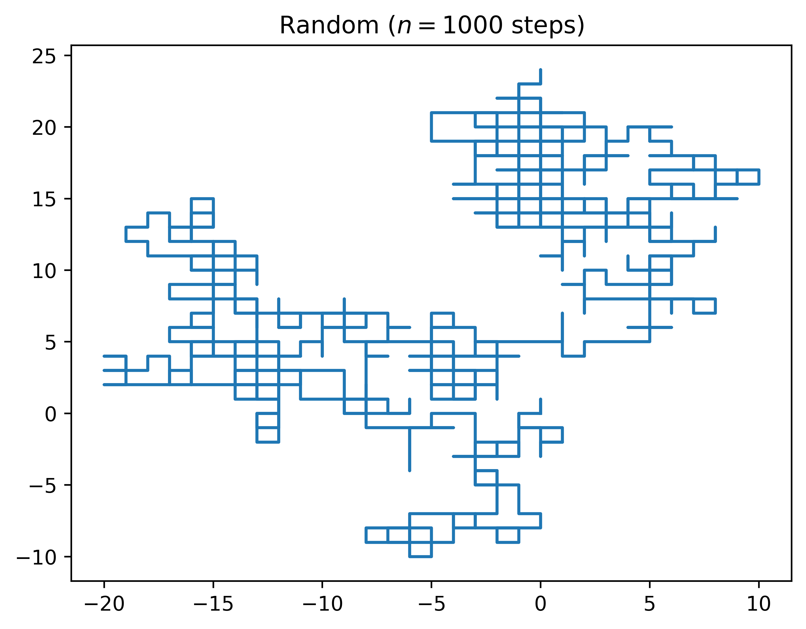
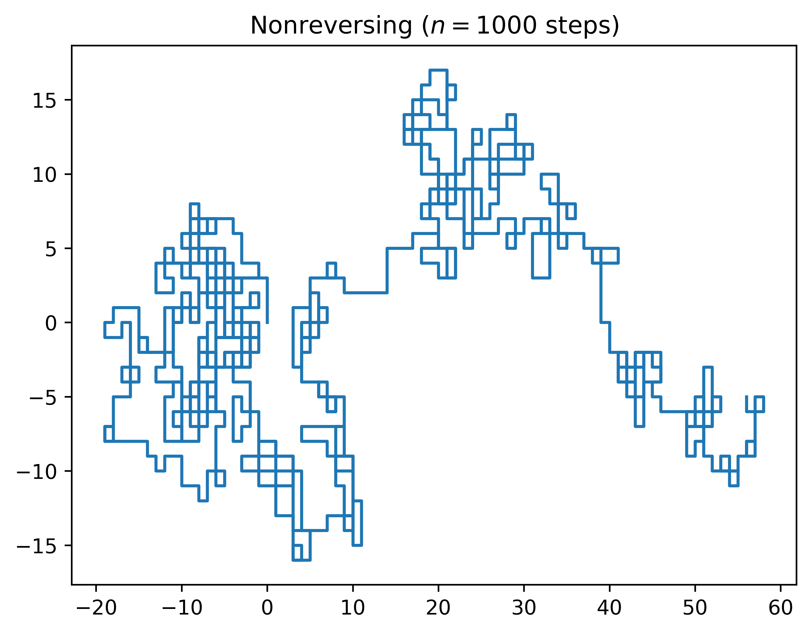
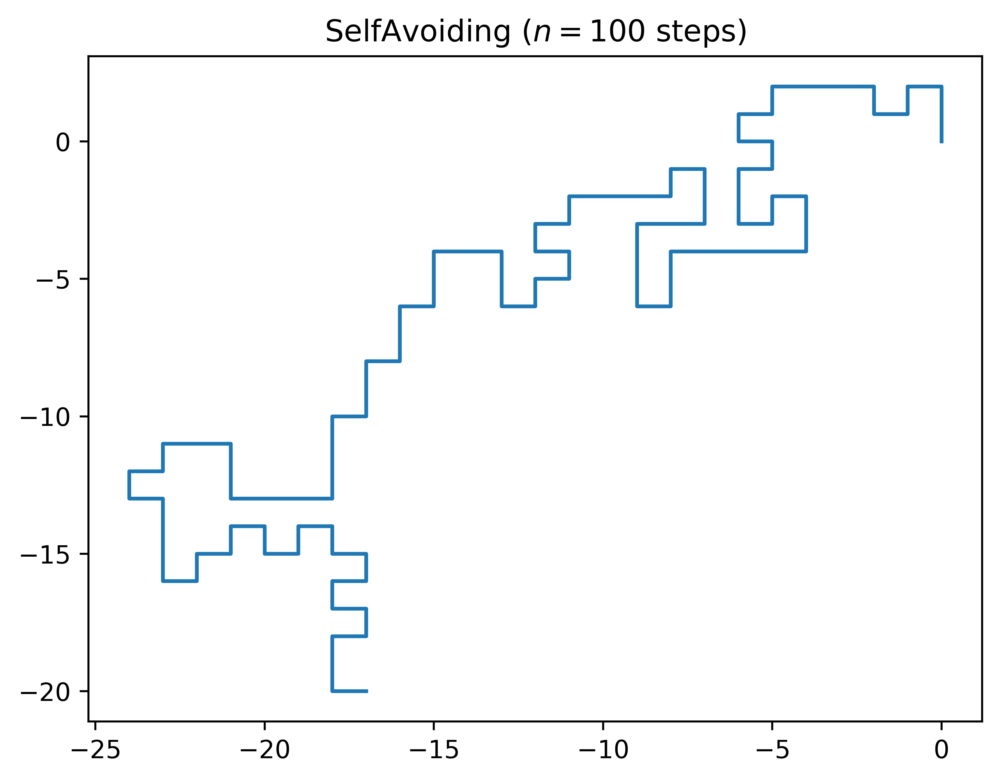

# Simulation de systèmes : travaux pratiques
## Création d'un générateur
Le générateur congruentiel linéaire constitue la base des générateurs de nombres
pseudo-aléatoires selon la formule : Xn+1 = (a*Xn + c) mod m

J’ai décidé de suivre la méthode de la famille dite : m puissance de 2 pour c = 0
- La sélection du modulo recommandé pour cette famille est 2^32 ou 2^64 cela permet
d’obtenir un générateur efficace car il n’a pas à effectuer de division euclidienne, il ne fait que parcourir la séquence binaire. J’ai sélectionné m = 2^64.
- La sélection du multiplicateur correspond à un entier congru à 3 ou à 5 modulo 8. J’aidonc cherché une date significative qui répond à ces critères tout en me permettant de nommer mon générateur de nombre aléatoire. 1989 est congru a 3 modulo 8 etcorrespond à la date de la chute du mur de Berlin. J'ai sélectionné a = 1989.
- La constante c doit être égale à zéro pour cette famille de LCG, donc c = 0.
- Dans cette famille la période maximale correspond à m/4 lorsque a est congru à 3 ou à 5 modulo 8, ce qui est notre cas.

## Test du générateur
Dans cette partie nous cherchons à vérifier la pertinence du générateur grâce à des tests statistiques. Nous présentons ici, les deux tests abordés en cours : Khi2 et Kolmogorov-Smirnov.  
Le code est disponible dans le fichier LCG_statistics_tests.py.  

Le test consiste à simuler 1000 lancers de deux dés à 6 faces, en les additionnant on constate les fréquences des résultats observés. Ensuite il faut calculer les fréquences attendues pour ces 1000 lancers.  

A partir de ces données les tests permettront de trancher sur la qualité du générateur de nombre aléatoire que nous avons défini précédemment.

|             |`2`|`3`|`4`|`5`|`6`|`7`|`8`|`9`|`10`|`11`|`12`|
| ------------|---|---|---|---|---|---|---|---|----|----|----|
| `attendues` |27 |55 |83 |111|138|166|138|111|83  |55  |27  |
| `observées` |28 |53 |78 |110|147|170|145|107|90  |46  |26  |

Pour effectuer ces tests, j’ai appris à me servir de la bibliothèque python SciPy afin d’éviter les erreurs d’implémentation.  

Pour le test du Khi2 on obtient le résultat suivant 3.7781926886169948 ainsi qu’une pvalue de 0.9567988181918744.  

Pour le test de Kolmogorov-Smirnov on obtient les résultats suivants : 0.18181818181818182 avec une pvalue équivalente à 0.9970968144342757.  

On confirme l’hypothèse selon laquelle les fréquences observées ne sont pas significativement différentes des fréquences attendues.

## Utilisation du générateur
Les marches aléatoires sont implémentées dans le fichier LCG_walks.py.  
Ce programme s’utilise à l’aide de la ligne de commande :
```sh
python3 LCG_walks.py -h
#usage: LCG_walks.py [-h] [-n STEPS] [-w WALK]
#optional arguments:
#  -h, --help            show this help message and exit
#  -n STEPS, --steps STEPS
#                        Specify how many steps to simulate
#  -w WALK, --walk WALK  random=C, nonreversing=S, avoiding=U
```

La commande suivante génére une marche aléatoire de 1000 pas :
```sh
python3 LCG_walks.py -n 1000 -w C
# Random walk travel distance is 36508.56022907505
```
Elle enregistre également dans le repertoire courant un graphique du déplacement de l'agent selon la marche et le nombre de pas.




Dans le cas de la marche aléatoire, le motif ressemble aux déambulations dans une ville dense.  
La marche aléatoire sans retour s’y apparente également mais elle suggère un paysage plus étendu.  
Tandis que le motif de la marche aléatoire auto-évitante correspond au tracé d’une côte.
Ces modèles nous permettent de valider graphiquement la qualité du générateur de nombres aléatoires. A nombre de pas égaux, la marche auto-évitante parcourt la plus grande distance.